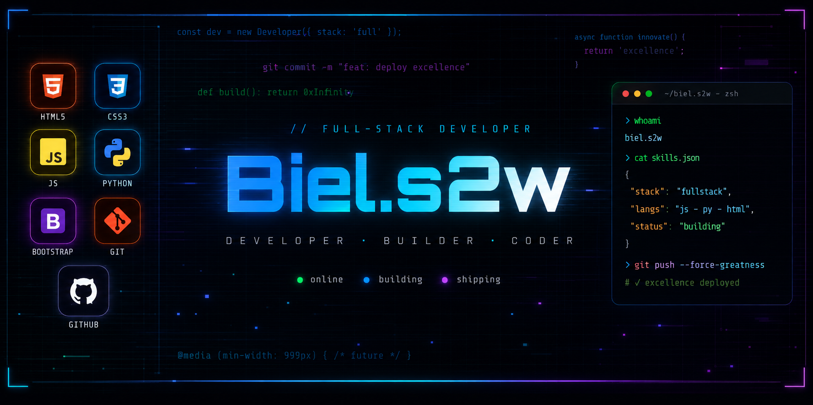

-----

<i><b>Olá</b> 👋, sou o <code>Gabriel Oliveira</code>, tenho 18 anos e sou estudante de <code>Engenharia de Software</code> na <a href="https://www.pucminas.br/" target="_blank">PUC Minas</a>. 💻 Atualmente, estou em busca de <code>novas oportunidades</code>, experiências e novidades no mercado de tecnologia, com foco em desenvolvimento de software e evolução profissional.</i> 🚀

-----

  

-----

 Biels2w Spotify Data

<table>
<tr>
 <td align="center" colspan="3"></td>
</tr> 
<tr>
<td>

</td>
<td>

</td>
<td>

</td>
</tr>
<tr>
 <td align="center" colspan="3"></td>
</tr> 
</table>

----

<table>
<tr>
 <td align="center" colspan="11"></td>
</tr> 
<tr>

<td>
</td>
<td>
</td>
<td>
</td>
<td>
</td>
<td>
</td>
</tr>
<tr>
 <td align="center" colspan="11"></td>
</tr> 
</table>

-----
<table align="center">
<tr>
<td>

</td>

<td width="40"></td>

<td>

</td>
</tr>
</table>

-----

<picture>
  <source media="(prefers-color-scheme: dark)"
    srcset="https://raw.githubusercontent.com/joaopauloaramuni/joaopauloaramuni/output/pacman-contribution-graph-dark.svg">
  <source media="(prefers-color-scheme: light)"
    srcset="https://raw.githubusercontent.com/joaopauloaramuni/joaopauloaramuni/output/pacman-contribution-graph.svg">
  
</picture>
