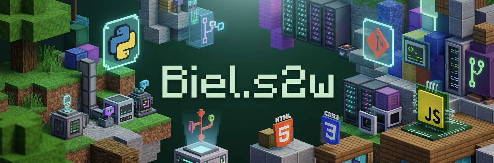

  <!-- Banner no topo -->
  

<h1 align="center">Olá, eu sou o Gabriel de Oliveira! 👋</h1>

  🎓 Estudante de Engenharia de software na <b>PUC Minas</b> | 💻 19 anos

  Apreciador de tecnologia, programação e desenvolvimento de software. Sempre buscando aprender novas tecnologias e aprimorar minhas habilidades.

---

### 🛠️ Tecnologias e Ferramentas

   &nbsp;
   &nbsp;
   &nbsp;
   &nbsp;
   &nbsp;
   &nbsp;
  

---

GitHub Stats:

<table>
<tr>
 <td align="center" colspan="2">:watch: <a href="https://wakatime.com/@Biels2w">WakaTime</a></td>
</tr> 
<tr>
<td></td>
<td>

</td>
</tr>
</table>

<table>
<tr>
 <td align="center" colspan="3"></td>
</tr> 
<tr>
<td>
<!--  -->

</td>
<td>
<!--  -->

</td>
<td>

</td>
</tr>
<tr>
 <td align="center" colspan="3"></td>
</tr> 
</table>

</td>
<td>

</td>
</tr>
<tr>
 <td align="center" colspan="3"></td>
</tr> 
</table>

<table>
<tr>
 <td align="center"></td>
</tr>
<tr>
 <td align="center"></td>
</tr>
<tr>
 <td align="center"></td>
</tr> 
</table>

---

### 🎵 Spotify - Recents

  

---

### 📬 Conecte-se comigo

<table>
<tr>
 <td align="center" colspan="11"></td>
</tr> 
<tr>
<!--<td>-->

<td>
</td>
<td>
</td>
<td>
</td>
<td>
</td>
<!--<td>
</td>-->
<td>
</td>

</tr>
<tr>
 <td align="center" colspan="11"></td>
</tr> 
</table>

---

 <table>
 <tr>
  <td align="center" colspan="2"></td>
 </tr> 

<picture>
  <source media="(prefers-color-scheme: dark)"
    srcset="https://raw.githubusercontent.com/joaopauloaramuni/joaopauloaramuni/output/pacman-contribution-graph-dark.svg">
  <source media="(prefers-color-scheme: light)"
    srcset="https://raw.githubusercontent.com/joaopauloaramuni/joaopauloaramuni/output/pacman-contribution-graph.svg">
  
</picture>
